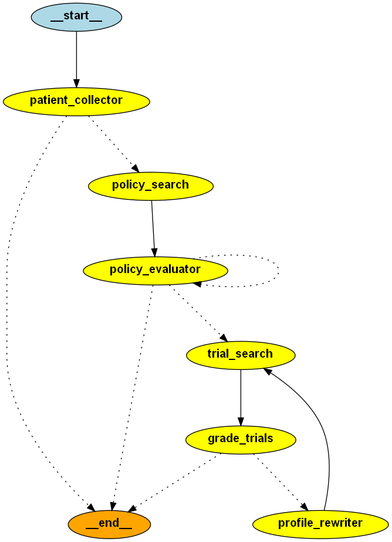

# LLM Tutorials and Applications

## Overview

The goal of this repository is to provide a collection of applications that can be used with Large Language Models (LLMs). These applications serve as starting points for building advanced LLM products. The material collected here is sourced from public resources, including GitHub repositories and various courses.

As the technology evolves, some packages and tools may become outdated. However, efforts will be made to update this repository with new tools and technologies whenever possible. At the very least, these notebooks demonstrate the product-level possibilities available for leveraging LLMs.

## Table of Contents
- [Fundamentals](#fundamentals)
- [Retrieval-Augmented Generation (RAG)](#retrieval-augmented-generation-rag)
- [Agents and Tools](#agents-and-tools)
- [Case Studies](#case-studies)
- [Installation](#installation)
- [Contributing](#contributing)
- [License](#license)

## Case Studies:
In the following notebooks, different databases and practical use cases are presented. The purpose is to expand your imagination towards the broad applications of LLMs in different domains. These sample scenarios include:
- Technical support as a chatbot technician
- Entity extraction from customer travel queries
- Customer support
- Healthcare consultation
- Patient inquiry analysis
- Patient symptom categorization
- Search and summary of clinical trials
- Search and retrieve information from the Novartis 2023 annual report
- Information retrieval from the Amazon Product Catalog

## Fundamentals
The Fundamentals section covers the essential concepts and techniques for working with Large Language Models (LLMs). This section provides a solid foundation for understanding and utilizing LLMs, including topics such as chatbots, conversational agents, chains, prompt templates, and output parsers. By exploring these basics, you will gain the necessary skills to build simple to advanced applications that leverage the power of LLMs for various conversational tasks and QA systems.

This section covers general topics related to QA, chatbots, chains, and other conversational topics with LLMs, ranging from simple to advanced.

- **[Introduction and Basics of Chatbots and Conversational Agents](notebooks/Fundamentals/QA_chatbot.ipynb)**
  - A direct API call from OpenAI to perform chat completions
  - Chat completions with LangChain APIs
  - Using prompt templates to create custom prompts
  - Using output parsers to extract key information from completions
  - **Use Cases:**
    - Technical support as a chatbot technician
    - Entity extraction from customer travel queries

- **[Using Memory to Have an Interactive Conversational Chatbot](notebooks/Fundamentals/QA_chatbot_memory.ipynb)**
  - Complete memory recording
  - Window-based memory
  - Summary-based memory
  - **Use Cases:**
    - Technical support
    - Customer support
    - Healthcare consultation

- **[Using LangChain to Generate LLM Chains](notebooks/Fundamentals/llm_chains.ipynb)**
  - Introduction to chains
  - LLMChain and Language Execution Chain (LEC)
  - Intermediate outputs in chains
  - **Use Cases:**
    - Patient inquiry analysis
    - Patient symptom categorization

- **Coming Soon:**
  - Using few-shot chains to instruct LLMs
  - Numerical evaluation metrics: BLEU, ROUGE, METEOR, CER


## Retrieval-Augmented Generation (RAG)

Retrieval-Augmented Generation (RAG) is a powerful technique that combines the strengths of information retrieval and natural language generation. By integrating retrieval mechanisms with LLMs, RAG can access and utilize vast amounts of external knowledge, enabling the generation of more accurate, contextually relevant, and informative responses. This approach is particularly useful for tasks requiring up-to-date information, detailed explanations, or specific data points, significantly enhancing the capabilities and performance of LLM-based applications.

- **[Question and Answering (QA) Over Documents Using RAG](notebooks/Retrieval_Augmented_Generation/RAG_basic.ipynb)**
  - A simple in-memory RAG application using LangChain based on a CSV file
  - **Use Case:**
    - Search and summary of clinical trials

- **[RAG Application Using Persistent and Cloud-Based Vector Stores](notebooks/Retrieval_Augmented_Generation/RAG_vectorstores.ipynb)**
  - Using a public embedding model from Hugging Face
  - Applying chunking strategy for analyzing large documents
  - Using a persistent vector store from Chroma DB
  - A cloud-based vector store from Pinecone
  - **Case Study:**
    - Search and retrieve information from the Novartis 2023 annual report

- **[Evaluation of Retrieval-Augmented Generation Using QAGenerator](notebooks/Retrieval_Augmented_Generation/RAG_evaluation.ipynb)**
  - Using QAGenerator to create ground truth samples for QA applications
  - Evaluating QA-based RAG using QAGeneratorChain and QAEvalChain
  - **Case Study:**
    - Information retrieval from the Amazon Product Catalog

- **Coming Soon:**
  - Ranking retrieved documents using similarity scores
  - Using UMAP to visualize retrieved document similarity
  - Window-based, hierarchical retrieval, and MAP-RERANK to expand input length of RAG pipelines
  - Graph RAG

## Agents and Tools

Large Language Model (LLM) agents are crucial for creating dynamic, interactive, and context-aware applications. These agents can handle complex tasks by understanding and generating human-like text, making them invaluable in automating processes, providing intelligent responses, and integrating with various tools and services to perform specific actions. By leveraging LLM agents, developers can build robust applications that offer enhanced user experiences and operational efficiencies.

- **[Agent-Based Application of Large Language Models](notebooks/Agents_and_Tools/llm_agents_basics.ipynb)**
  - An LLM agent that calls a single Python interpreter tool
  - A ReAct-based LLM agent that uses two built-in tools, a calculator and a Wikipedia search
  - User-defined agent and its tools
  - **Based on [Langchain v0.1](https://python.langchain.com/v0.1/docs/get_started/introduction)**: Create a separate venv

- **[# LLM Agents for Clinical Trial Management](notebooks/Agents_and_Tools/llm_agents_pharma.ipynb)**
  - An agentic LLM application that automates the evaluation of patient for clinical trials.
  - Patient database, Trial database, Participatient policies.
  - RAG, Tool calling, Langgraph, Hallucination grader.
  - **Based on [Langchain v0.2](https://python.langchain.com/v0.2/docs/introduction/)**: Create a separate venv
  

  - 


## Installation
First, clone the repository:
```bash
git clone https://github.com/bab-git/llm-tutorials.git

cd llm-tutorials
```

Then install the dependencies:
Here, we use the provided `requirements.txt` file. But for more complex applications use poetry to install the dependencies.

```bash
pip install -r requirements.txt
```

**Note:**
The notebooks presented in this repository use the package versions as stated in the `requirements.txt` file. However, some Langchain packages might become deprecated over time, and you may need to update them. To ensure you have the latest versions, you may also need to run:
```bash
pip install -U langchain langchain-community langgraph <or other packages>
```
In case of updating package, you may also need to update parts of the codes in the notebooks based on the latest package versions.

**Requirements:**   
Make sure you have the following dependencies installed:
- Python 3.8 or higher
- pip

## Secrets
You need to set a few API keys as environment variables to use Openai, Pinecone, Hugging Face, and Tavily via API calls.

For the above services you also need to create the relevant accounts on their websites.

Using LangSmith (and adding its env variables) is optional, but it is highly recommended for training and development purposes.  

## License

This project is licensed under the MIT License. See the [LICENSE](LICENSE) file for details.
